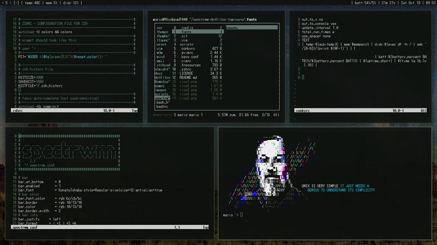

# Katana® Software.

#
### What's Katana Software?,
`Katana is Compiler Software for Compiling Pawn Code of San Andreas Multiplayer (SA-MP)`
#
## installation:
```
$ git clone https://github.com/universestate/Katana-Software
```
#
## requirements:
- `You only need your SA-MP GameMode, whether version 0.3.7 or 0.3.DL. and also you must have a Pawn Compiler file called` "*pawncc.exe*" `and if you don't have it please get it from` [Pawn Lang](https://github.com/pawn-lang/compiler/releases)
- **Tutorial installing**: `install the batch file from` "[\src](https://github.com/universestate/Katana-Software/tree/e193de36c726be3fb41689e0bf7231b5d605dd00/src)" `into your gamemode directory. and follow the preview`: [YouTube Video](https://www.youtube.com/watch?v=Xn5ZiOmkCPM).
- On Linux: please see [Linux.ORG](https://www.linux.org/threads/running-windows-batch-files-on-linux.11205/) first.
#
### Example HelloWorld & Looping.
```pwn
#include "a_samp"

main() {
  print "Hello, World"

  for (new i = 0; i >= 0; i++) { // infinity loop.
      printf "%d", i;
  }
}
```
**Output**:

