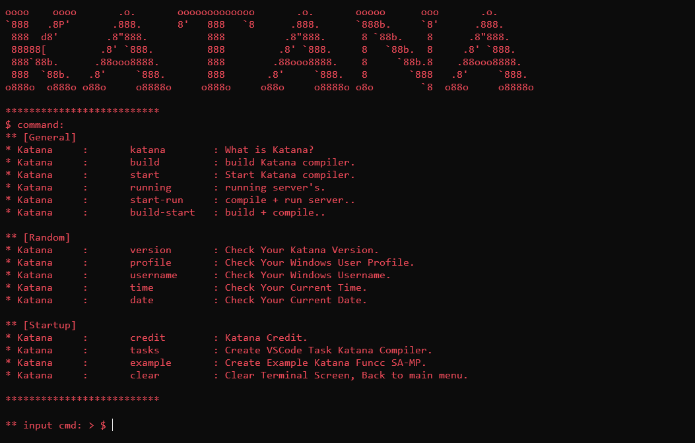
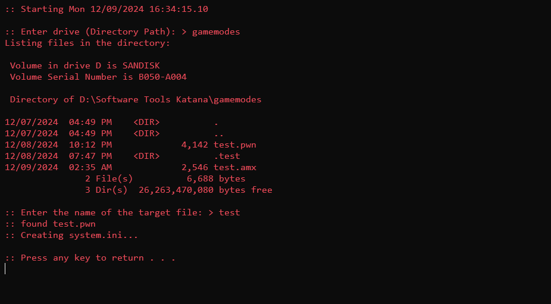
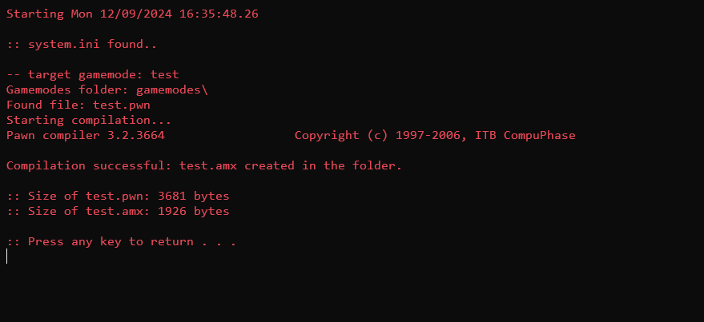

# Katana® Software.
```
oooo    oooo       .o.       ooooooooooooo       .o.       ooooo      ooo       .o.       
`888   .8P'       .888.      8'   888   `8      .888.      `888b.     `8'      .888.      
 888  d8'        .8"888.          888          .8"888.      8 `88b.    8      .8"888.     
 88888[         .8' `888.         888         .8' `888.     8   `88b.  8     .8' `888.    
 888`88b.      .88ooo8888.        888        .88ooo8888.    8     `88b.8    .88ooo8888.   
 888  `88b.   .8'     `888.       888       .8'     `888.   8       `888   .8'     `888.  
o888o  o888o o88o     o8888o     o888o     o88o     o8888o o8o        `8  o88o     o8888o 
```
#
### What's Katana Software?,
`Katana is a compiler software used for compiling Pawn code in San Andreas Multiplayer (SA-MP).` ||
`Katana Soft is inspired by Ken Thompson, the scientist who created UNIX and the C programming language.`
## installation:
```
$ git clone https://github.com/universestate/Katana-Software
```
## requirements:
`All you need is your SA-MP GameMode, whether it's version 0.3.7 or 0.3.DL. You will also need a Pawn Compiler file called` 'pawncc.exe' .. `If you don’t have it, you can download it from` [Pawn Lang](https://github.com/pawn-lang/compiler/releases).
|| **installing Tutorials**: `install the batch file from` "[src](https://github.com/universestate/Katana-Software/tree/e193de36c726be3fb41689e0bf7231b5d605dd00/src)" `into your gamemode directory.`
|| On Linux: please see [Linux.ORG](https://www.linux.org/threads/running-windows-batch-files-on-linux.11205/) first.
# snippets
## katana-cmd

## katana-setup

## katana-start

## Example Helloworld & Looping.
```pwn
#include "a_samp"

main() {
  print "Hello, World"

  for (new i = 0; i >= 0; i++) { // infinity loop.
      printf "%d", i;
  }
}
```
```pwn
// goto..
#include "a_samp"

main() {}

public OnPlayerUpdate(playerid) {
  new ping = GetPlayerPing(playerid);

  if (ping > 999 || ping >= 1000 || ping <= 0) {
    goto end;
  } else {
    // do here..
  }

end:
  // do here..
  Kick(playerid);

  return 1;
}
```
### Output Helloworld & Looping.

