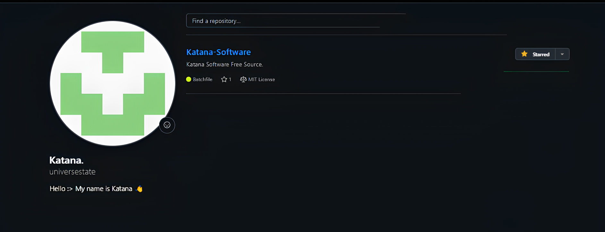

# Katana-Software

What is Katana Software?, Katana Software is Compiler Software for Compiling Pawn Code which is used for the Programming Language of San Andreas Multiplayer (SA-MP)
requirements:
- You only need your SA-MP GameMode, whether version 0.3.7 or 0.3.DL. and also you must have a Pawn Compiler file called "pawncc.exe" and if you don't have it please get it from [Pawn Lang](https://github.com/pawn-lang/compiler/releases)
- install the batch file from "/src/" into your gamemode directory. and follow the preview:: https://www.youtube.com/watch?v=Xn5ZiOmkCPM
- VSCode Tasks Tutorial: 
