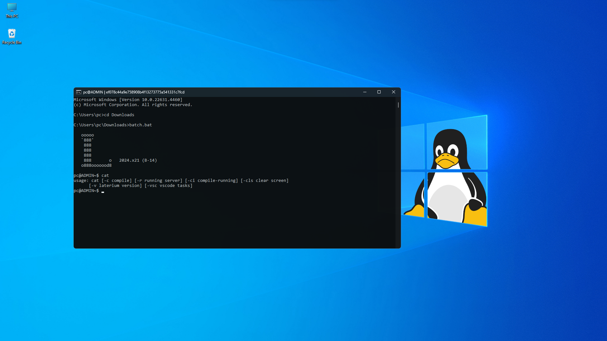
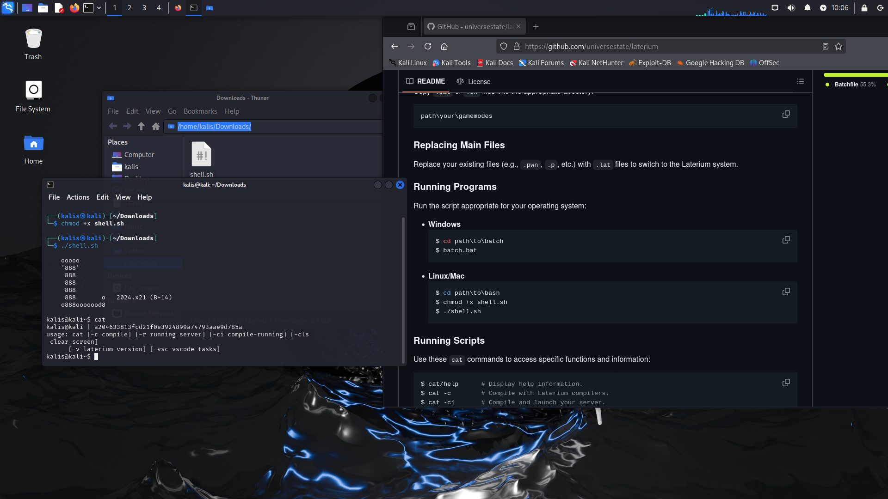

## Usage Instructions

### Cloning the Repository
`Clone the Laterium repository using the following command:`
```bash
$ git clone https://github.com/universestate/laterium.git
```

### Preparing the Environment
`Copy `.bat` or `.sh` files into the appropriate directory:`
```
path\your\gamemodes
```

### Replacing Main Files
`Rename the file (for example: .pwn, .p, etc.) that serves as the main gamemode file to .lat, according to the Laterium system file format.`

### Running Programs
`Run the script appropriate for your operating system:`

- **Windows**  
  ```bat
  $ cd path\to\batch
  $ batch.bat
  ```
  
- **Linux/Mac**  
  ```sh
  $ cd path\to\bash
  $ chmod +x shell.sh
  $ ./shell.sh
  ```
  
  
### Running Scripts
`Use these `cat` commands to access specific functions and information:  `
```bash
$ cat/help      # Display help information.
$ cat -c        # Compile with Laterium compilers.
$ cat -ci       # Compile and launch your server.
$ cat -v        # Display version information.
```

---
